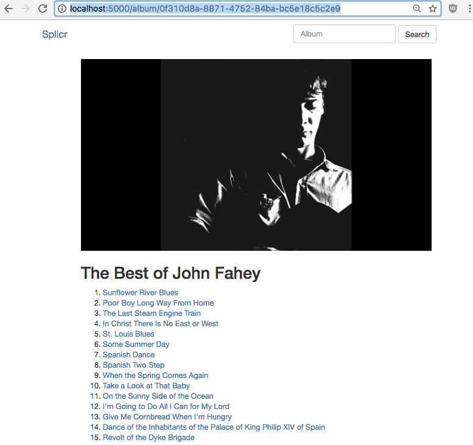

### Splicr

Splicr is a bare-bones and stateless [Flask](http://flask.pocoo.org/) app for finding and playing full length albums on Youtube. Splicr orders a playlist of Youtube videos using the top search results for each *artist* and *track name* pair in an Album's track list. These, in turn, are obtained from the [MusicBrainz](https://musicbrainz.org/) database.

Because Youtube will not have every song, and sometimes prefers covers or live-recordings, Splicr often produces non-standard playlists. Often these present welcome departures from tired studio recordings; other times they disappoint. Mileage varies. 

### Setup

Splicr is bare-bones. I have given little consideration to aesthetics and security; it is meant to run *locally*. You will need (1) source, (2) a handful of dependencies, and a (3) youtube api key. Patches and pull requests welcome.

```bash
[...]% git clone https://github.com/28mm/Splicr.git
[...]% cd Splicr
[...]% pip3 install -r requirements.txt
[...]% export YOUTUBE_KEY='YOUR_YOUTUBE_KEY_HERE'
[...]% export FLASK_APP=Splicr.py
[...]% flask run
```


