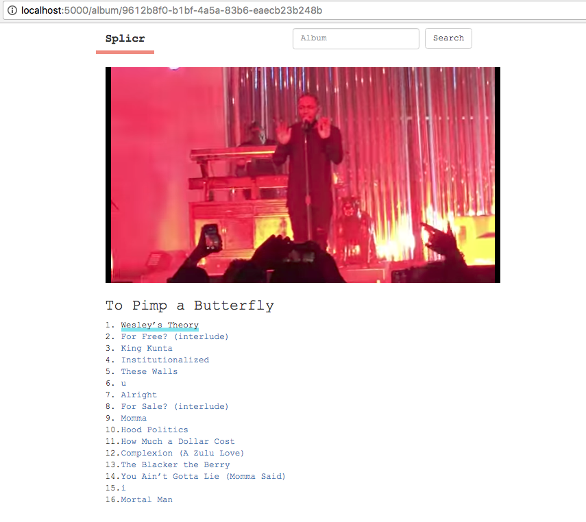

### Splicr

Splicr is a bare-bones, stateless [Flask](http://flask.pocoo.org/) app that finds and plays full length albums on Youtube, using track listings from the [MusicBrainz](https://musicbrainz.org/) database.

Because Youtube does not have every song, and is missing many studio recordings, Splicr often produces unusual combinations of covers, concert performances, and bizarre unrelated material. Mileage varies!

### Setup

Splicr is farily spartan. To run a local instance, you will need a handful of dependencies, and a youtube api key. Patches and pull requests welcome.

```bash
[...]% git clone https://github.com/28mm/Splicr.git
[...]% cd Splicr
[...]% pip3 install -r requirements.txt
[...]% export YOUTUBE_KEY='YOUR_YOUTUBE_KEY_HERE'
[...]% export FLASK_APP=Splicr.py
[...]% flask run
```


